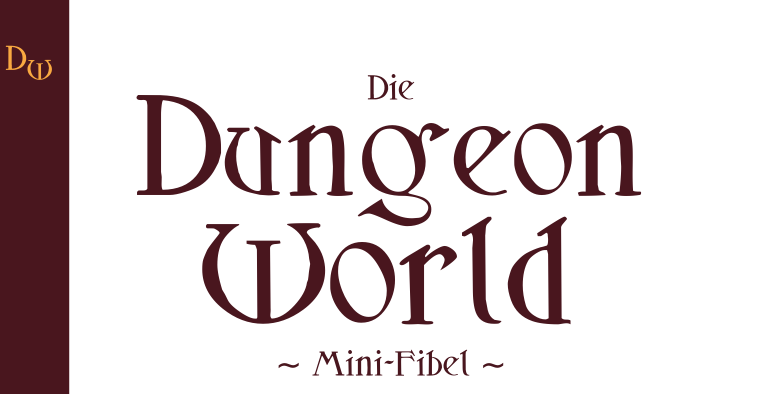
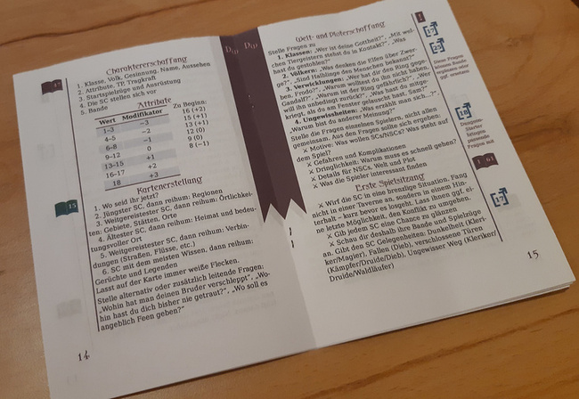

# Die Dungeon World Mini-Fibel

Eigentlich wollte ich nur einen Spickzettel für [Dungeon World](https://dungeon-world.com/) basteln. Der ist ein wenig ausführlicher ausgefallen, als ich das ursprünglich beabsichtigt habe. Aber vielleicht hilft er ja auch noch mehr Leuten als nur mir.

* [Links](links.md) zu den verwendeten Quellen bzw. zu hilfreichen Artikeln.
* [Download (zum Drucken)](https://github.com/zauberlehrling-nek/dw-minifibel/releases/download/v1.0.0/dw-minifibel-print-v1.0.0.pdf)
* [Download (zum digital Betrachten)](https://github.com/zauberlehrling-nek/dw-minifibel/releases/download/v1.0.0/dw-minifibel-view-v1.0.0.pdf)

[CC-BY-SA](https://creativecommons.org/licenses/by-sa/4.0/) Zauberlehrling Nek
